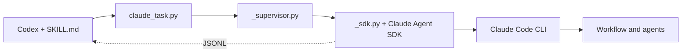

# Claude Agent

A Codex skill for delegating tasks to an installed Claude Code CLI. Supports individual tasks, session continuation, and dynamic workflows with multiple agents.

The adapter uses the official Python Claude Agent SDK and Claude Code's existing authentication and history. Claude Desktop is not required. The adapter has no database, MCP server, or persistent background service.

## Use in Codex

Name the skill and describe the task:

```text
Use claude-agent to review error handling in the current project.
Read-only review.
```

For a workflow:

```text
Use claude-agent to run a dynamic workflow that reviews the current project:
two independent reviewers, followed by verification of their findings.
```

[SKILL.md](SKILL.md) contains the instructions for Codex. Tasks use the current project directory unless another location is specified. Claude loads its native project and global `CLAUDE.md` instructions, including symlinks to `AGENTS.md`; these files do not need to be copied into the prompt.

## Installation

Requires Python 3.11+, `claude` on `PATH`, and working Claude Code CLI authentication.

```sh
skill_root="$HOME/.agents/skills/claude-agent"
python3 "$skill_root/scripts/install_runtime.py"
```

The installer creates `.venv` beside the skill and installs the dependencies pinned in [requirements.txt](scripts/requirements.txt). After cloning this repository on another machine or moving it, create the runtime again: `.venv` and caches are excluded from Git.

Codex discovers the skill directly at:

```text
~/.agents/skills/claude-agent
```

Run the repository's `setup.sh` to connect the shared instructions to Codex and Claude Code. This skill is used by Codex, so setup does not link it into Claude Code's own skills.
The source lives in `local/skills/claude-agent`; the installed directory is a symlink, so edits apply immediately.

Individual scripts do not need registration. `SKILL.md` is the skill entry point, and supporting files live in the same directory tree. This setup does not require a `config.toml` entry.

## Manual invocation

Run these examples from the project directory, with `skill_root` set as above. Prepare a UTF-8 file at `work/claude-task.txt` containing the task, allowed changes, and expected result.

```sh
python3 "$skill_root/scripts/claude_task.py" \
  --cwd "$PWD" \
  --access read \
  --prompt-file ./work/claude-task.txt
```

Model and effort use Claude Code's native defaults unless explicitly overridden with `--model MODEL` or `--effort LEVEL`. Either flag can be supplied independently. These options apply to the main Claude session; agent-specific overrides belong in the Workflow script. For all options:

```sh
python3 "$skill_root/scripts/claude_task.py" --help
```

| Option | Purpose |
| --- | --- |
| `--cwd` | Required working directory for Claude. |
| `--title` | Short task name for the chat summary; otherwise the first prompt line is used. |
| `--model` | Optional model override; accepts a name or alias supported by the CLI. |
| `--context-window` | Optional auto-compaction window in tokens (100000-1000000), capped at the model's capacity. Omit to use native settings. |
| `--effort` | Optional effort override: `low`, `medium`, `high`, `xhigh`, or `max`; support depends on the model and CLI. |
| `--access` | Built-in tool profile: `none`, `read`, or `edit`. Defaults to `read`. |
| `--allow-command` | Additional Bash permission rule. Repeatable; for example, `--allow-command 'git diff *'`. |
| `--permission-mode` | Override Claude's configured permission mode for this run: `manual`, `auto`, `dontAsk`, `acceptEdits`, or `plan`. |
| `--resume` | UUID of an existing Claude session. |
| `--idle-timeout` | Maximum silence without observable Claude activity, in seconds. Defaults to 900. Alias: `--timeout`. |
| `--input-timeout` | Timeout for one user response. Defaults to 3600. Alias: `--approval-timeout`. |

`read` includes Read, Glob, and Grep. `edit` also includes Edit and Write. All profiles include AskUserQuestion. These profiles are not a filesystem sandbox. Claude's native settings, hooks, connectors, and permission rules remain active.

Briefs use `verbatim_prompts`: file mentions and slash commands remain literal. Claude's automatic per-turn context is deferred until after its first tool call.

Auto-compaction is enabled for each invocation; saved Claude settings are unchanged.

### Permissions and questions

Use a prompt file and keep stdin open (`tty: true` in Codex). Tool permissions follow Claude's native settings. The adapter relays requests as `approval_required` and clarifying questions as `question_required`. See [User input](references/input.md) for the response format.

### Continue a session

Take `session_id` from the previous result and prepare `work/followup.txt`:

```sh
python3 "$skill_root/scripts/claude_task.py" \
  --cwd "$PWD" \
  --resume SESSION_UUID \
  --access read \
  --prompt-file ./work/followup.txt
```

Replace `SESSION_UUID` with the actual UUID. Calls to one session must run sequentially with the same working directory. Codex keeps the ID in chat context; Claude Code stores the conversation history. Another Codex chat does not automatically receive this ID.

## Dynamic workflows

Explicitly request a dynamic workflow in `work/workflow-task.txt`, then run:

```sh
python3 "$skill_root/scripts/claude_task.py" \
  --cwd "$PWD" \
  --access read --workflow \
  --prompt-file ./work/workflow-task.txt
```

See [Dynamic workflows](references/workflows.md) for progress events and completion rules. Permissions and questions use the same input channel as individual tasks.

## Results and interruption

The adapter emits JSONL: one JSON event per line. Wait for the final `type: result` event. An intermediate `workflow_finished` event does not include the coordinator's final synthesis.

| Status | Meaning |
| --- | --- |
| `completed` | The task completed successfully. |
| `denied` | The workflow was declined, or the approval input closed before a decision. |
| `needs_permission` | A tool request did not receive the required permission. |
| `timed_out` | Claude activity stopped for the idle window, or user-input waiting timed out. |
| `cancelled` | Execution was cancelled. |
| `workflow_not_started` | Workflow mode was requested, but no workflow launch was observed. |
| `incomplete` | The workflow or its final synthesis did not complete. |
| `failed` | Execution failed. |

Permission denial reasons appear in `permission_denials`. An error message, when available, appears in `error`. The `models` field lists actual models reported by the native session, which may include auxiliary Claude models.

Omitted model and effort overrides appear as `null` in the request metadata. This does not report Claude's resolved defaults; use `models` for the actual models used.

The final event also includes `summary`, `answer_file`, and `presentation_warnings`. Codex shows a compact Markdown summary: one line for a single agent, one row per separate agent run, or phase rows and a total for native Claude workflows. See [Results](references/results.md) for metric boundaries and the display format.

For a successful single-agent call, `answer_file` points to an exact UTF-8 copy of Claude's final answer at `~/.claude/claude-agent/answers/<session-id>/<unique-id>.md` (under `CLAUDE_CONFIG_DIR` when set). Resuming a session creates another file. Workflow calls export no answer files; their metrics are read from Claude's existing workflow JSON. Missing native data or an answer export error produces a presentation warning without changing execution success.

A workflow refusal, EOF, or input timeout closes the input channel for the current invocation. See [User input](references/input.md) for details.

On cancellation, timeout, or loss of the calling process, the supervisor stops the worker process group. After an interrupted call, a returned `session_id` alone does not guarantee complete history; inspect the result and project changes before resuming.

### Activity-based timeout

Runs have no total duration limit. `--idle-timeout` measures silence since the latest observable activity, including streamed response content, completed tool results, task lifecycle events, and changing token/tool counters. Streaming uses the SDK's `include_partial_messages` option; its content is not forwarded into the chat. Activity checks and local watchdog messages make no additional model calls.

The legacy `--timeout` flag now aliases the idle limit. The default remains 900 seconds, independent of model and effort. A run that keeps making progress can continue for hours. API pings and workflow updates that only change elapsed time do not reset the timer. Waiting for permission or an answer suspends it; resolving the request starts a fresh window. `--input-timeout` remains a separate limit for user responses.

The watchdog runs in the supervisor, outside the SDK event loop, so a blocked worker can still be terminated. An idle timeout returns `timed_out` and exit code 124, with three seconds allowed for cleanup before the process group is killed. This detects lack of observable activity, not a proven deadlock: a tool or API operation that stays silent for the entire window can still time out. Subagent token deltas are not forwarded by the SDK; workflow progress counters and lifecycle events provide their activity signals.

Host event forwarding runs in a separate thread with a temporary disk buffer, so a full stdout pipe cannot block timeout checks or parent-loss detection. After worker cleanup, forwarding gets up to three seconds to drain. If the host still does not read, the supervisor exits; delivery of the remaining output cannot be guaranteed. The temporary buffer is removed on exit.

## Components



| File | Role |
| --- | --- |
| [SKILL.md](SKILL.md) | Instructions for Codex. |
| [references/workflows.md](references/workflows.md) | Workflow and approval protocol. |
| [references/results.md](references/results.md) | Chat summary and answer links. |
| [scripts/claude_task.py](scripts/claude_task.py) | Arguments, environment checks, and launch. |
| [scripts/_supervisor.py](scripts/_supervisor.py) | Process supervision and event forwarding. |
| [scripts/_sdk.py](scripts/_sdk.py) | SDK calls, approvals, progress, and observed outcomes. |
| [scripts/_contracts.py](scripts/_contracts.py) | Job, outcome, and private event definitions shared by the processes. |
| [scripts/_result.py](scripts/_result.py) | Final status, summary, answer export, and exit code. |
| [scripts/_activity.py](scripts/_activity.py) | Observable activity detection for the idle watchdog. |
| [scripts/_output.py](scripts/_output.py) | Buffered host event forwarding independent of watchdog checks. |
| [scripts/_presentation.py](scripts/_presentation.py) | Native workflow metrics and verbatim answer export. |
| [scripts/install_runtime.py](scripts/install_runtime.py) | Local Python runtime setup. |
| [scripts/requirements.txt](scripts/requirements.txt) | Pinned SDK dependency. |
| [agents/openai.yaml](agents/openai.yaml) | Skill display name and description; not Claude agent definitions. |
| [tests/](tests/) | Adapter rules and process tests using real SDK message types. |

## Development checks

Install the skill runtime first. Tests use its SDK types and replace `query` with local scenarios; no model is contacted. Direct tests cover adapter rules, while subprocess tests cover input exchange, process cleanup, and the watchdog. SDK permission policies are not simulated.

```sh
PYTHONDONTWRITEBYTECODE=1 local/skills/claude-agent/.venv/bin/python -B -m unittest discover \
  -s local/skills/claude-agent/tests -v
```

## Troubleshooting

- `dependency_missing`: run the runtime installer from the installation section.
- `history_unwritable`: the execution environment blocks writes to Claude's own history. Grant this access through the environment's normal permission mechanism.
- Authentication errors: check the installed Claude Code CLI's login. The adapter does not use Claude Desktop authentication.

Execution summaries use ordinary Markdown in the chat and require no visualization plugin.
